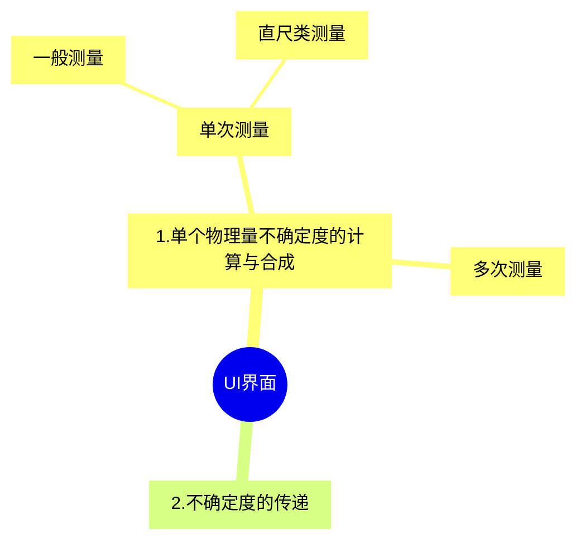

# Uncertainty Calculator 

> 功能介绍：
>
> * 实现单个物理量不确定度的计算以及合成
> * 给出物理量之间的关系，实现物理量之间不确定度的传递
> * 有美观的UI界面，可以与用户交互

## UI界面

> 进入程序的首页为功能选择页面，可选择**单个物理量不确定度的计算与合成**和**不确定度的传递**两个功能

* 功能1：单个物理量不确定度的计算与合成

  > 进入功能1，会提示选择测量类型，有**单次测量**和**多次测量**两种类型

  * 单次测量：
    * 一般测量：用户输入物理量的**测量值**（仅一个数据）、**仪器的不确定度限值**、**仪器的最小分度值**，用户选择物理量的**分布类型**（均匀分布、正态分布、和三角形分布，默认为均匀分布）、选择估读情况（1/10、1/5、1/2、1），输出该物理量的测量值以及不确定度。
    * 直尺类测量：用户输入物理量的**测量值**（两个数据）、**仪器的不确定度限值**、**仪器的最小分度值**，用户选择物理量的**分布类型**（均匀分布、正态分布、和三角形分布，默认为均匀分布）、选择估读情况（1/10、1/5、1/2、1），输出该物理量的测量值以及不确定度。
  * 多次测量：用户输入**物理量的测量数据列表**、**t因子**（默认为1）、**仪器的不确定度限值**，用户选择物理量的**分布类型**（均匀分布、正态分布、和三角形分布，默认为均匀分布），输出该物理量的测量值以及不确定度。

* 功能2：不确定度的传递

  * 输入：input物理量（x_1,x_2,...,x_n）的测量值、相应的不确定度（ux_1,ux_2,...,ux_n）、input物理量与output物理量y之间的函数关系y=y(x_1,x_2,...,x_n)
  * 输出output物理量的测量值以及不确定度

## 具体如何计算

